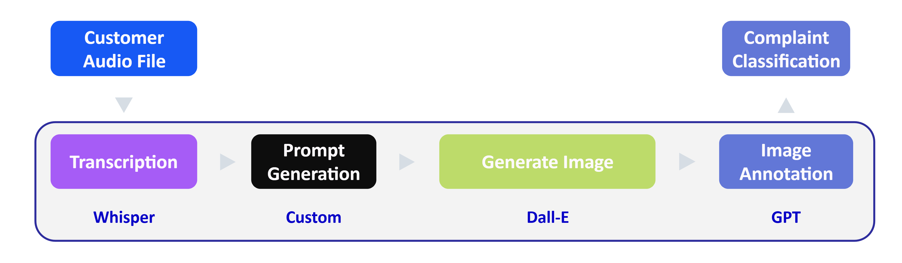

# Customer Complaint Classification



## Overview

This project implement a generative AI-based solution for classifying customer complaints. The project involves various steps such as transcribing customer audio complaints, generating images, describing and annotating those images, and finally classifying the complaints into appropriate categories.

1. **Transcribing Customer Audio Complaint**:

   - The first step is to convert the customer's audio complaint into text using a speech-to-text model. This involves using the `whisper.py` module.

2. **Create Prompt from Transcription**:

   - Once the audio is transcribed, a prompt is created from the transcription that will be used to generate a visual representation of the complaint.

3. **Generate Image Representing the Issue**:

   - Using the prompt created from the transcription, an image is generated to visually represent the customer complaint. This is managed by the `dalle.py` module.

4. **Describe the Generated Image**:

   - The generated image is then analyzed to provide a description of its contents, using the `vision.py` module. This helps identify the key elements related to the issue.

5. **Annotate the Reported Issue in the Image**:

   - The key reported issue in the image is highlighted through annotation, which includes identifying specific objects or areas related to the complaint.

6. **Classify Complaint into Category/Subcategory Pair**:
   - Use the generated image description and the catalog metadata to classify the complaint into a category and subcategory. This is handled by the `gpt.py` module.


## File Structure

### Overall Structure
```
customer-complaint-classification/
│
├── main.py              # Main orchestrator for the project workflow
├── whisper.py           # Module for audio transcription
├── dalle.py             # Module for image generation
├── vision.py            # Module for image description and annotation
├── gpt.py               # Module for complaint classification
├── categories.json      # File containing category and subcategory metadata
├── audio/               # Directory for input audio files
├── dev/                 # demo code for how to interact with different models and how to use azure openai service
├── imgs/                # Images used in Readme file
└── output/              # Directory for storing intermediate results and log file.
```


### Detailed explanation for following files:

1. **`whisper.py`**:

   - This file contains a function to transcribe audio complaints into text using the Whisper model.

2. **`dalle.py`**:

   - Contains the function `generate_image()` to create an image representing the issue.

3. **`vision.py`**:

   - This file contains a function to describe the generated image and annotate it with the key elements identified.

4. **`gpt.py`**:

   - Contains a function `classify_with_gpt()` that takes in an image description and classifies the complaint into an appropriate category/subcategory.

5. **`main.py`**:

   - Orchestrates the entire workflow, calling each of the modules in sequence.


## Prerequisites

- Azure OpenAI Service:
   - Deployments for `Whisper`, `DALL-E`, and `GPT` models are necessary.
   - Obtain API keys and set up the endpoint URL in the Azure portal.
- Azure Resource Group: 
   - Create a resource group in your Azure account for managing related resources (e.g., `OpenAI services`).

- Set up environment variables for secure access to Azure services:
   1. Create a `.env` file in the root directory of the project.
   2. Add the following environment variables to the `.env` file (for method how to get below information, see [How to deploy models on azure](#how-to-deploy-models-on-azure):
      ```txt
      AZURE_OPENAI_API_KEY=your_api_key_here 
      AZURE_OPENAI_ENDPOINT=your_endpoint_url_here 
      WHISPER_DEPLOYMENT=your_whisper_deployment_name 
      WHISPER_VERSION=your_whisper_api_version 
      GPT_DEPLOYMENT=your_gpt_deployment_name 
      GPT_VERSION=your_gpt_api_version
      DALLE_DEPLOYMENT=your_dalle_deployment_name 
      DALLE_VERSION=your_dalle_api_version
      ```
      > Replace the placeholders with your actual values from the Azure portal. 
      > If you use different regions in your models, make sure differentiate the version of the API for each model by name.
   3. Ensure that the `.env` file is added to your `.gitignore` to prevent sensitive information from being committed to version control.

## Data Formats

- Input:
   - Audio files: Supported formats include `MP3` and `WAV` for transcription.
- Output (see details for each sample in `output` folder):
   - Text files for transcription (`transcription.txt`).
   - PNG images for visual representations (`generated_image.png`, `annotated_image.png`).
   - Text files for image descriptions and classifications (`image_description.txt`, `classification.txt`).
   - `output.log`: Log file for tracking the execution of the project.
- Other files:
   - `categories.json`: Contains the category and subcategory metadata for classification.
   - `prediction.json`: Contains the final classification results in JSON format.
   - `labels.json`: Contains the labels used for classification, corresponding with `audio` folder.

## Usage

### Environment Setup
- Clone the repository to your local machine:
   ```bash
   git clone https://github.com/deepbiolab/customer-complaint-classification.git
   ```
- Navigate into the project folder:
   ```bash
   cd customer-complaint-classification
   ```

- Ensure `Python 3.12` is installed on your system
   - If not, using `conda` create a virtual environment(recommend)
      ```bash
      conda create -n complaint_clf python=3.12
      conda activate complaint_clf
      ```
- Install dependencies:

   ```bash
   pip install -r requirements.txt
   ```

### Quickstart
```bash
python main.py
```

The project is a sequential execution of below tasks:
   1. Run `main.py` to initiate the process.
   2. Transcription via `whisper.py` processes audio file in `audio` folder and returns text.
   3. Prompt generation in `main.py` feeds into `dalle.py` for image creation.
   4. Image analysis and annotation are performed in `vision.py`.
   5. Classification is finalized in `gpt.py` based on text and image outputs.

## Resources

- [OpenAI API Documentation](https://beta.openai.com/docs/)


## Detailed Report
- [Detailed Report](./dev/Report.md)


## How to deploy models on Azure
- [Deployment instruction](./dev/Deploy.md)


