### Login into [Azure](https://portal.azure.com/#home)
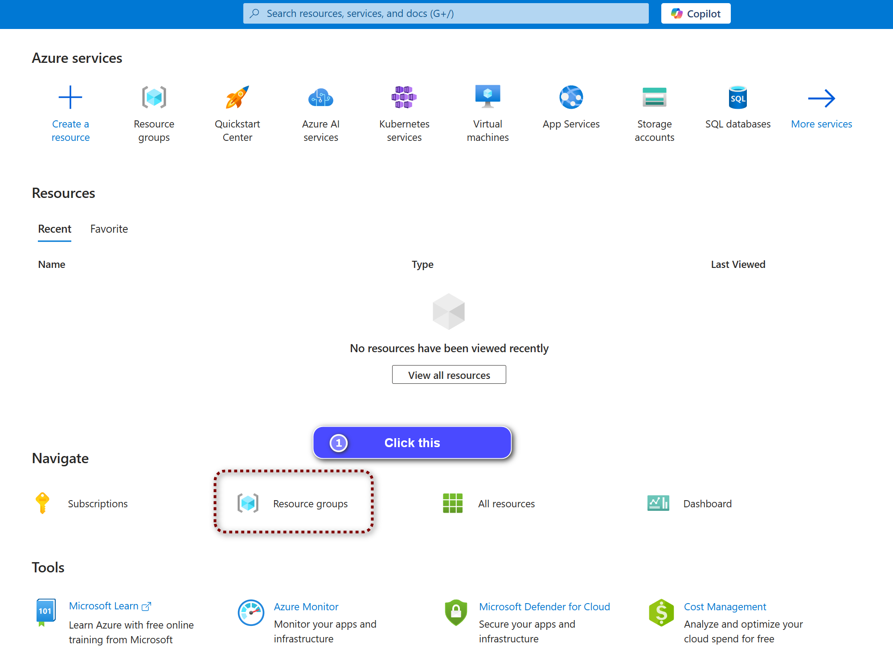

### Create a resource group as showed below and leave the rest as default
---
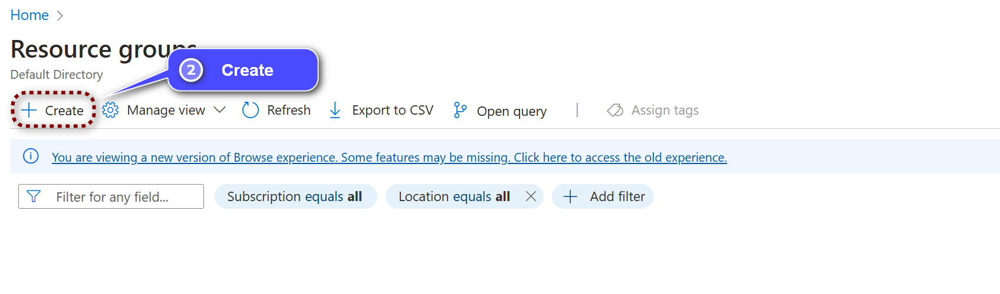
---
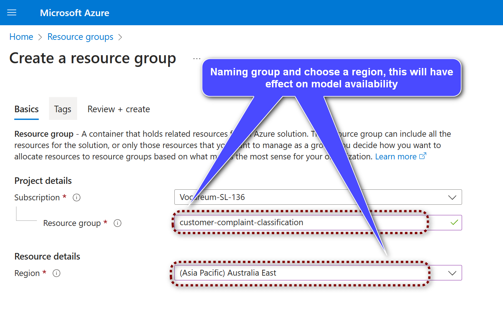
---
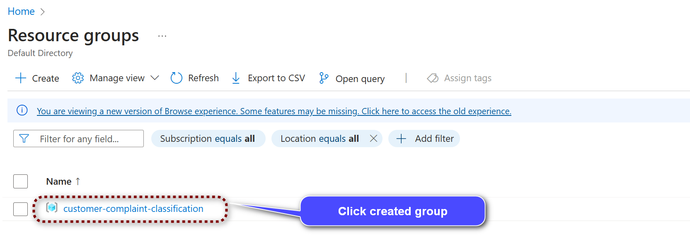

### Create a `OpenAI` service in the resource group
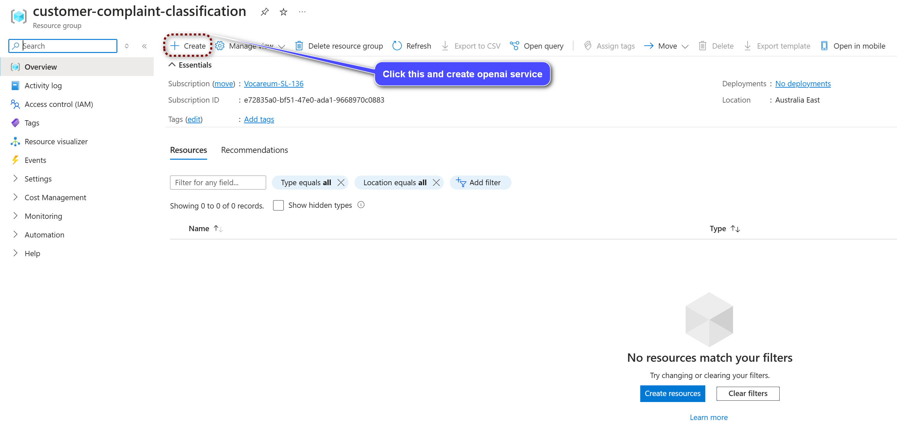
---
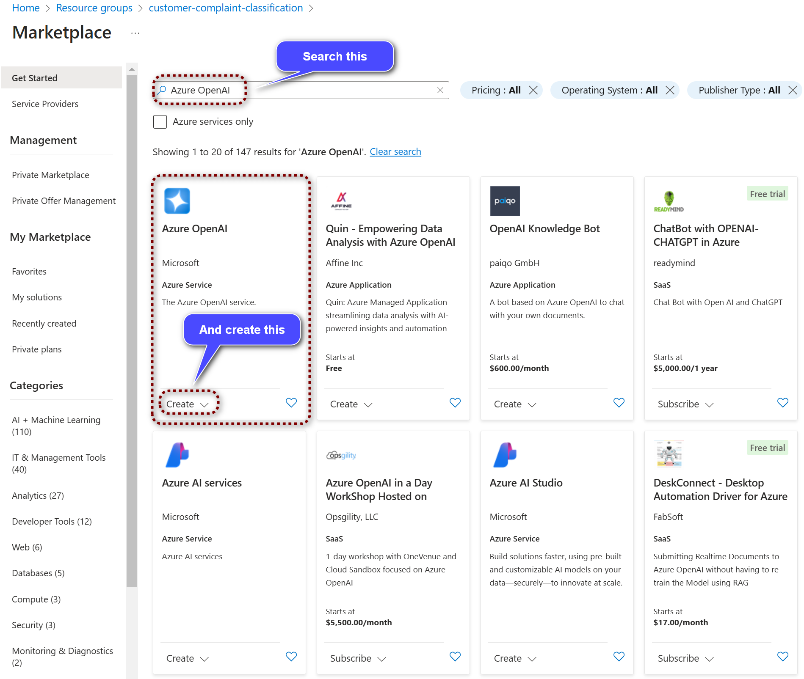
---
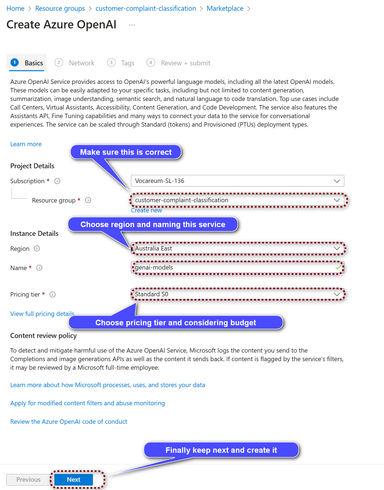
---
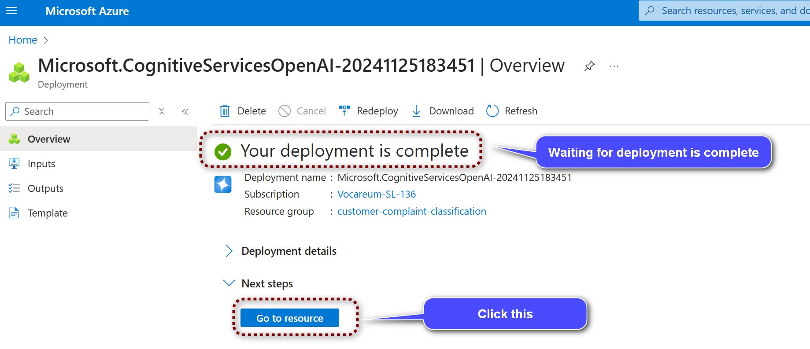
---
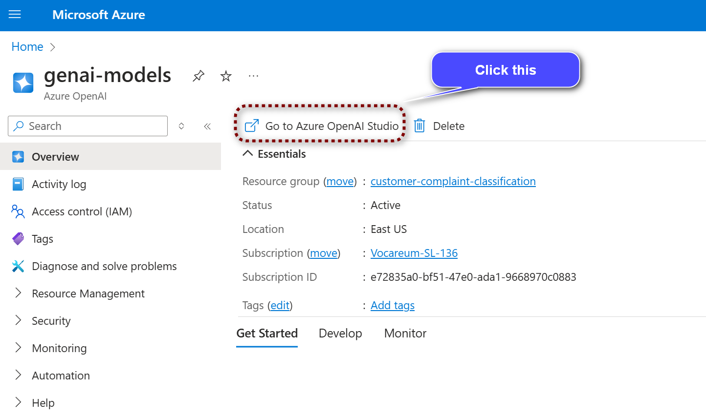

### Create a `Whisper` model in the `OpenAI` service
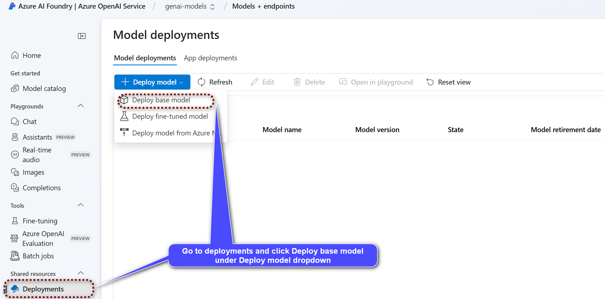
---
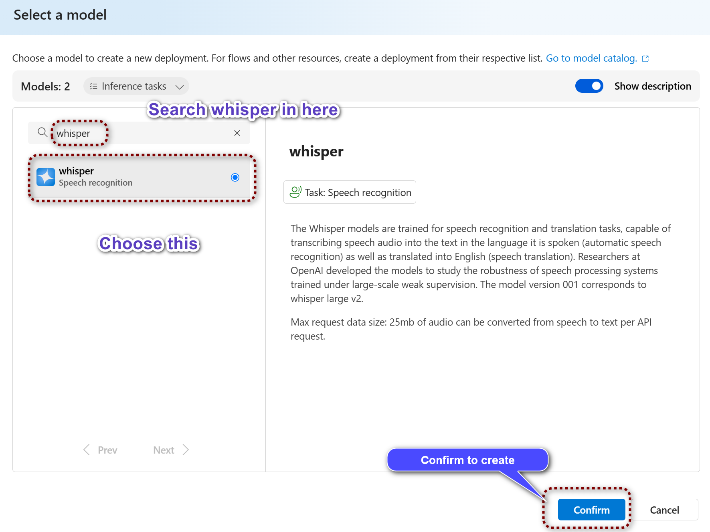
---
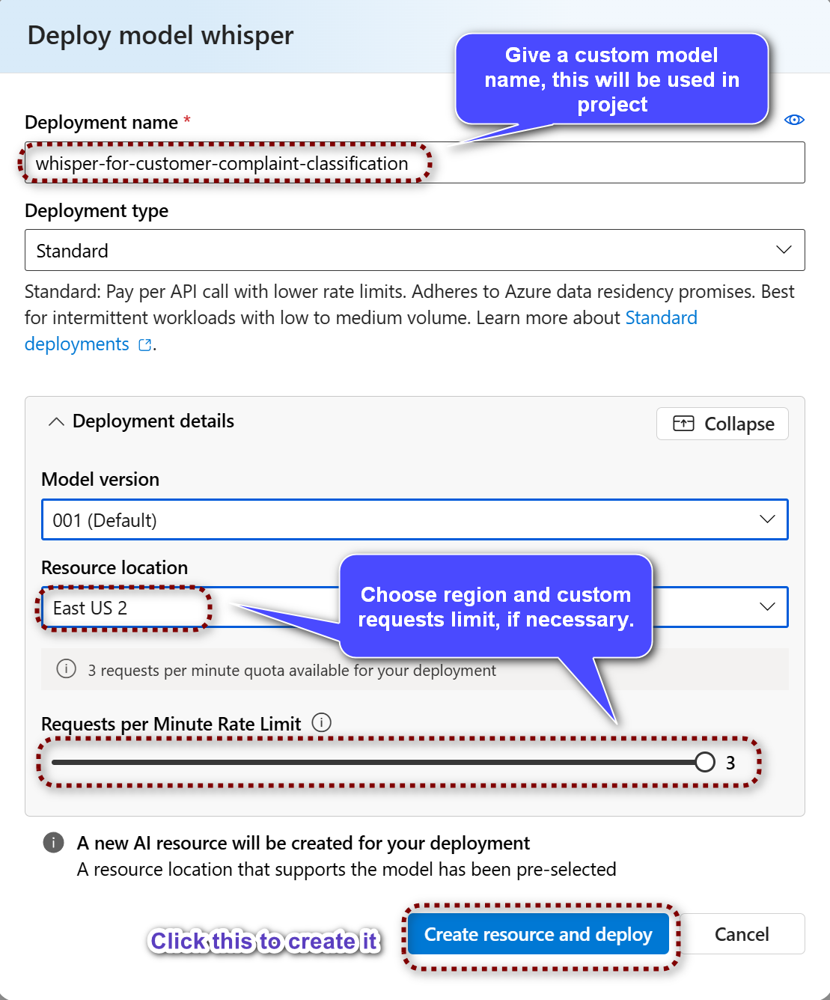

### Create a `DALL-E` model in the `OpenAI` service
	- method similar like Whisper
### Create a `GPT` model in the `OpenAI` service
	- method similar like Whisper
### Get the API key and endpoint URL from the `OpenAI` service
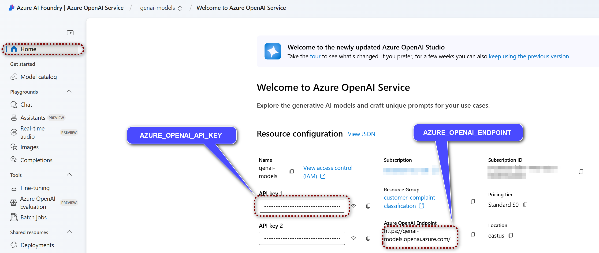
---
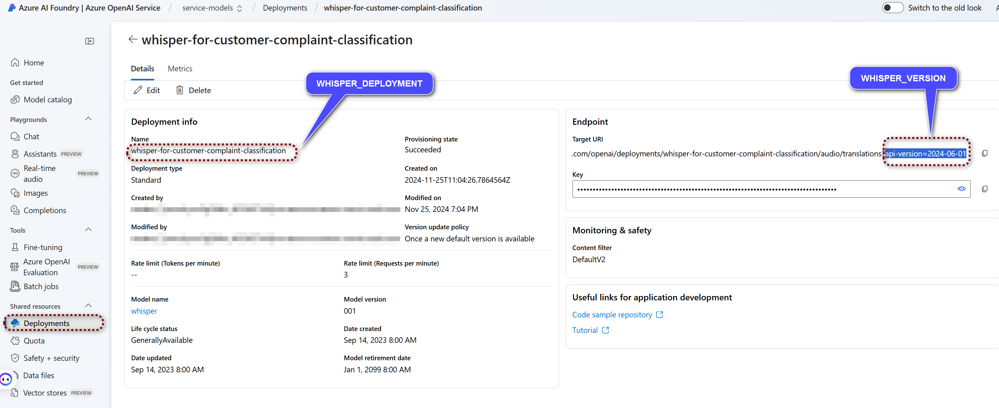

